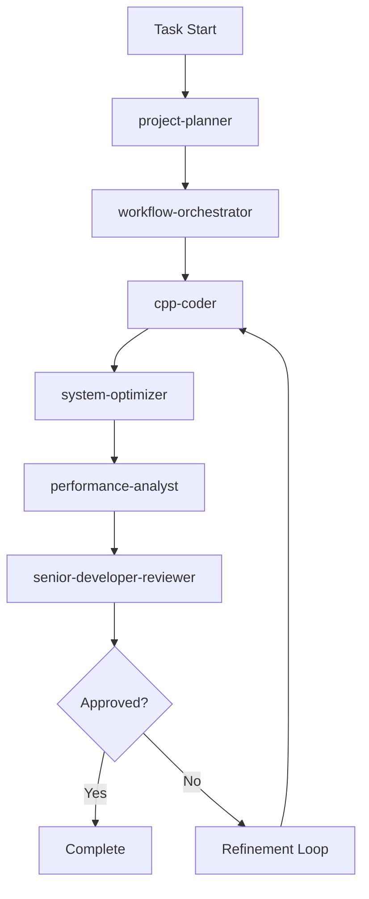

# Agent Workflow Handoff Protocols

## Standard Handoff Templates

### Phase 0: project-planner → workflow-orchestrator Handoff

**Template:**
```markdown
# Strategic Planning Handoff Report

## Requirements Analysis
- **Primary Objective:** [Clear statement of main goal]
- **Functional Requirements:** [Specific features/behaviors needed]
- **Non-Functional Requirements:** [Performance, scalability, maintainability]
- **Success Criteria:** [Measurable acceptance criteria]

## Architectural Impact Assessment
- **Systems Affected:** [Primary and secondary manager impacts]
- **Integration Complexity:** Simple/Moderate/Complex
- **Performance Risk:** Low/Medium/High impact on 10K+ entities
- **Thread Safety Concerns:** [Concurrency considerations]

## Implementation Strategy
- **Development Approach:** [Phased implementation plan]
- **Critical Dependencies:** [What must be built first]
- **Risk Mitigation:** [Identified challenges and solutions]
- **Validation Plan:** [Testing and benchmarking strategy]

## Agent Task Breakdown
### For cpp-coder:
- [ ] [Specific implementation tasks with acceptance criteria]

### For system-optimizer:
- [ ] [Integration optimization tasks with performance targets]

### For performance-analyst:
- [ ] [Benchmarking tasks with specific metrics]

### For senior-developer-reviewer:
- [ ] [Architectural review criteria and standards]

## Quality Gates Defined
- **Implementation Gate:** [Build + test success criteria]
- **Integration Gate:** [System interaction validation]
- **Performance Gate:** [Specific benchmark targets]
- **Architecture Gate:** [Standards compliance requirements]

## Next Steps for workflow-orchestrator
- [ ] Route planning specification to cpp-coder
- [ ] Establish success criteria tracking
- [ ] Monitor quality gate progression
- [ ] Coordinate agent handoffs per protocol
```

### Phase 1: cpp-coder → system-optimizer Handoff

**Template:**
```markdown
# Implementation Handoff Report

## Components Modified
- **Files Changed:** [list all .cpp/.hpp files]
- **New Dependencies:** [libraries/managers added]  
- **Build Artifacts:** [new executables/tests]

## Build Status
- **Debug Build:** ✅/❌ [`cmake -B build/ -G Ninja -DCMAKE_BUILD_TYPE=Debug` then `ninja -C build` status]
- **Release Build:** ✅/❌ [`cmake -B build/ -G Ninja -DCMAKE_BUILD_TYPE=Release` then `ninja -C build` status]
- **Test Results:** [`./run_all_tests.sh --core-only --errors-only` output summary]
- **Compilation Warnings:** [count and severity]
- **Application Test:** [`timeout 25s ./bin/debug/SDL3_Template` behavior validation]

## Integration Points
- **Manager Dependencies:** [AIManager, CollisionManager, etc.]
- **Event System Impact:** [new events or handlers]
- **Threading Considerations:** [ThreadSystem usage]
- **Rendering Pipeline:** [camera, double-buffering impact]

## Performance Considerations
- **Memory Allocations:** [new/changed allocation patterns]
- **CPU Hotpaths:** [performance-critical code added]
- **Entity Count Impact:** [affects 10K+ entity target?]
- **Threading Safety:** [locks, atomics, lock-free patterns]

## Next Steps for system-optimizer
- [ ] Analyze cross-manager interactions
- [ ] Optimize batch processing patterns
- [ ] Validate thread safety
- [ ] Check double-buffer integration
```

### Phase 2: system-optimizer → performance-analyst Handoff

**Template:**
```markdown
# Integration Optimization Report

## System-Level Changes
- **Cross-Manager Optimizations:** [specific improvements]
- **Batch Processing Updates:** [AI, events, particles]
- **Memory Access Patterns:** [cache-friendly changes]
- **Threading Optimizations:** [WorkerBudget usage]

## Performance Targets
- **Entity Count:** [target: 10K+ at 60+ FPS]
- **Memory Usage:** [acceptable bounds]
- **CPU Budget:** [target: <6% for AI system]
- **Frame Time:** [<16.67ms target]

## Benchmarks Required
- [ ] AI system performance: `./bin/debug/ai_optimization_tests`, `./bin/debug/ai_scaling_benchmark`
- [ ] Pathfinding performance: `./tests/test_scripts/run_pathfinding_tests.sh`, `./bin/debug/collision_pathfinding_benchmark`
- [ ] Full system test: `timeout 25s ./bin/debug/SDL3_Template`
- [ ] Memory analysis: `./tests/valgrind/quick_memory_check.sh`, `./tests/valgrind/cache_performance_analysis.sh`
- [ ] Thread safety: `./tests/test_scripts/run_thread_tests.sh`

## Integration Validation
- **Manager Interaction:** [optimized patterns implemented]
- **Event Processing:** [batch efficiency improved]
- **Resource Management:** [RAII compliance verified]
- **Shutdown Safety:** [m_isShutdown guards functional]

## Next Steps for performance-analyst
- [ ] Run comprehensive benchmark suite
- [ ] Compare against baseline metrics
- [ ] Identify remaining bottlenecks
- [ ] Validate memory usage patterns
```

### Phase 3: performance-analyst → senior-developer-reviewer Handoff

**Template:**
```markdown
# Performance Validation Report

## Benchmark Results
### AI System Performance
- **Entity Count:** [actual vs 10K+ target]
- **Frame Rate:** [FPS achieved vs 60+ target]  
- **CPU Usage:** [% vs 4-6% target]
- **Memory Usage:** [MB used, growth patterns]

### System Benchmarks
- **Collision Detection:** [performance metrics]
- **Pathfinding:** [pathfinding operation times]
- **Event Processing:** [events/second capacity]
- **Rendering Pipeline:** [frame time breakdown]

## Performance Requirements Status
- [ ] ✅/❌ 10K+ entities at 60+ FPS
- [ ] ✅/❌ AI system <6% CPU usage
- [ ] ✅/❌ Memory growth within bounds
- [ ] ✅/❌ No frame drops under normal load

## Bottleneck Analysis
- **CPU Bottlenecks:** [identified hotspots]
- **Memory Bottlenecks:** [allocation patterns]
- **Threading Bottlenecks:** [synchronization issues]
- **I/O Bottlenecks:** [asset loading, save/load]

## Regression Analysis
- **Performance Regressions:** [compared to baseline]
- **Memory Regressions:** [increased usage patterns]
- **Stability Issues:** [crashes, deadlocks]

## Recommendations
- **Immediate Fixes:** [critical performance issues]
- **Optimization Opportunities:** [future improvements]
- **Architecture Concerns:** [design issues identified]

## Next Steps for senior-developer-reviewer
- [ ] Validate architectural compliance
- [ ] Review code quality standards
- [ ] Assess long-term maintainability
- [ ] Determine approval/refinement status
```

### Phase 4: senior-developer-reviewer → Refinement/Completion

**Template:**
```markdown
# Architectural Review & Decision

## Code Quality Assessment
- **C++20 Standards:** ✅/❌ [compliance verified]
- **Coding Conventions:** ✅/❌ [style guide adherence]  
- **RAII Principles:** ✅/❌ [smart pointer usage]
- **Thread Safety:** ✅/❌ [proper synchronization]

## Architectural Compliance
- **Manager Pattern:** ✅/❌ [singleton + shutdown guards]
- **Module Organization:** ✅/❌ [proper src/include structure]
- **Header Minimalism:** ✅/❌ [implementation in .cpp]
- **Dependency Management:** ✅/❌ [forward declarations used]

## Integration Assessment  
- **System Boundaries:** ✅/❌ [clean interfaces maintained]
- **Event Coupling:** ✅/❌ [loose coupling preserved]
- **Performance Integration:** ✅/❌ [no architecture conflicts]
- **Testing Integration:** ✅/❌ [testable design maintained]

## Decision Matrix
| Criteria | Status | Notes |
|----------|--------|-------|
| Functionality Complete | ✅/❌ | |
| Performance Requirements Met | ✅/❌ | |
| Code Quality Standards | ✅/❌ | |
| Architectural Integrity | ✅/❌ | |
| Long-term Maintainability | ✅/❌ | |

## Final Decision
- [ ] **APPROVED** - Ready for production
- [ ] **REFINEMENT REQUIRED** - Specific improvements needed
- [ ] **REJECTED** - Major architectural issues

## Refinement Requirements (if needed)
### Priority 1 - Critical
- [Specific changes required]

### Priority 2 - Important  
- [Improvements recommended]

### Priority 3 - Enhancement
- [Future considerations]

## Next Iteration Instructions
**For cpp-coder:**
- [Specific implementation tasks]

**For system-optimizer:**  
- [Integration improvements needed]

**For performance-analyst:**
- [Additional metrics to validate]
```

## Workflow State Management

### Context Preservation Between Phases
```json
{
  "workflow_id": "unique_identifier",
  "task_description": "original user request",
  "current_phase": "cpp-coder|system-optimizer|performance-analyst|senior-developer-reviewer",
  "iteration_count": 1,
  "baseline_metrics": {
    "fps": 60,
    "entity_count": 10000,
    "cpu_usage": 4.5,
    "memory_mb": 256
  },
  "success_criteria": [
    "specific requirements list"
  ],
  "phase_outputs": {
    "cpp-coder": "implementation handoff report",
    "system-optimizer": "integration optimization report", 
    "performance-analyst": "performance validation report",
    "senior-developer-reviewer": "architectural review decision"
  }
}
```

### Quality Gate Checkpoints
Each phase must pass these gates before proceeding:

0. **Planning Gate:** Requirements complete + implementation strategy validated
1. **Implementation Gate:** Build success + basic tests pass
2. **Integration Gate:** System interactions optimized + thread safety verified  
3. **Performance Gate:** Benchmark targets met + no regressions
4. **Architecture Gate:** Standards compliance + maintainability assured

### Iteration Loop Handling


This protocol ensures consistent, high-quality handoffs between agents while maintaining the architectural integrity and performance standards of the SDL3 HammerEngine.