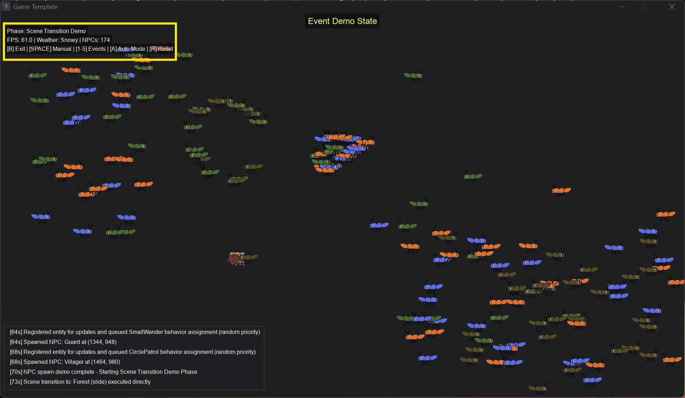
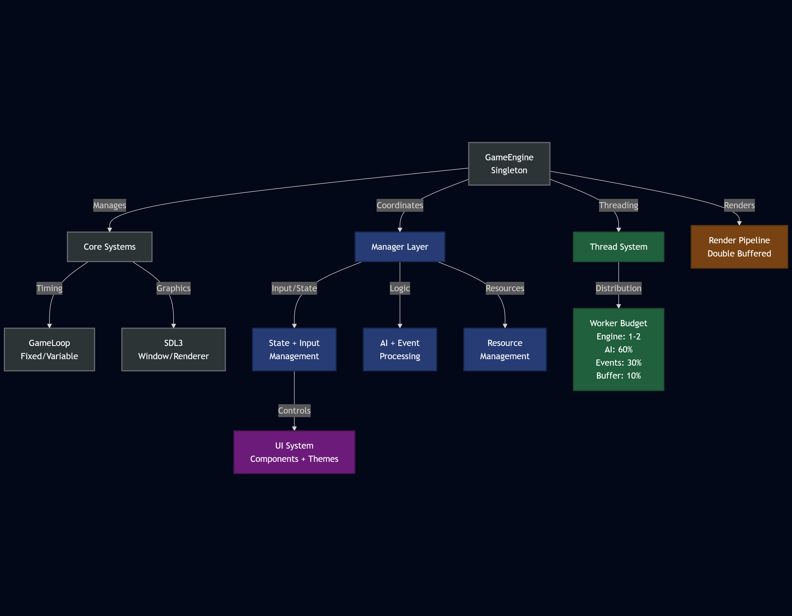

# SDL3 2D Game Template with Multi-Threading
  -Work in progress.... Features do work and are implemented! Also, learning all the features of github will implement more as I figure it out. Please strongly consider donating if you use this or like it! Its most appreciated!

Based off of my SDL2 template, but updated for SDL3 and completely transformed. It has simplified Entity management and Entity state management systems. Also has a more robust game state management system and uses CMake and Ninja instead of a custom build.sh. This is designed to be a jump off point for making a game with some of the low level and architecture stuff handled. Just add your content and start modifing the managers and add states. Demo's included to show how the systems integrate.

I use Warp Terminal/ADE with custom cmake and ninja task configurations to build/compile on all platforms. Warp has good documentation check it out at https://www.warp.dev

  - **Note**: Below in the Prerequisites I mentioned some ways that I used to get the project to compile on Windows. You may need some additional tweaks depending on your system and preferences. Via Cmake the compile_commands.json file is generated automatically and moved to the project root directory. This will allow Neovim/telescope diagnostics. If neovim is setup for LSP use.


### Generative AI useage
 - This project has evolved into a large-scale simulation engine—not like Unity or Unreal, but rather a framework that powers the game you want to create. I’m using AI to accelerate development, but it’s not building the architecture or tying everything together for me. I’ve designed the core systems and the shell of the engine myself, and AI is helping me refine it, especially when it comes to memory safety. One of my key goals is safety, which means no raw pointers, and no manual memory allocation or deallocation (no new or delete). I also leverage AI to help me synchronize threading, resolve crashes, optimize with valgrind, and cppcheck. I really strive to remove any underfined behaviour at all costs and AI helps me with that as well. I see AI as a powerful tool—like a well-crafted sword—that slays big nasty code issues, and helps me bring games to life. I hope you find this project useful or cool!

## Features Overview
- SDL3 integration with SDL_image, SDL_ttf, and SDL_mixer
- Fast header-only binary serialization system
- Cross-platform support (Windows, macOS, Linux)
- Multi-threading support with priority-based task scheduling
- Automatic dependency management with FetchContent
- Custom window icon support on all platforms
- Game state management system (state machine)
- Entity state management system (state machine)
- Event management system for game events (weather, scene transitions, NPC spawning, Quests)
- Save game system with fast BinarySerializer (smart pointer-based memory management)
- Texture management (auto loads all from img dir)
- Sound & Music management (auto loads all from sound and music dir) stop, start, pause, halt, play sfx
- Font management (auto loads all from font dir)
- Particle system with weather effects, visual effects, and WorkerBudget threading integration
- UI management system with comprehensive component support and layout management
- UI stress testing framework for performance validation and optimization
- AI Manager framework for adding AI behaviors that uses a messaging system
- High-Performance Multi-Threading system with WorkerBudget allocation and 4096 task queue capacity
- Test player and NPC sprites with 2 frame animations. They are all copyrighted - Hammer Forged Games (C) 2025
- Input handling:
  - Keyboard and mouse
  - Xbox series x controller support
  - PS4 Controller support
- Comprehensive testing framework with automated test runners:
  - Boost Unit testing for core components
  - UI stress testing and performance validation
  - AI scaling benchmarks (validates 10K entity performance target)
  - Event system performance and functionality tests
  - Threading system validation and optimization tests
  - Performance regression testing and continuous integration
  - **Stress testing up to 100K entities (500M+ updates/sec achieved) **Mac M3 Pro 11 core**

- Supports the following Image, Sound, and font formats:
  - Images: png
  - Sounds: wav, mp3, ogg
  - Fonts: ttf and otf

## Building the Project

### Prerequisites

- CMake 3.28 or higher
- Ninja build system (recommended)
- A C/C++ compiler with C++20 support. GCC and G++ 13.x - 15.x and Clang 17 MacOS
- Boost Test framework (optional, only for unit tests)

### Windows
Need to install msys2 for compiler and for SDL3 dependencies like harfbuzz, freetype etc.
scoop or chocolatey to install Ninja and cppheck.
Cmake can be installed from the official website.
Cpp check can be installed other ways just make sure its in your path.

Windows will need some env vars setup for path to compile:
- C:\msys64\mingw64\lib
- C:\msys64\mingw64\include
- C:\msys64\mingw64\bin

Packages needed:
- mingw-w64-x86_64-boost - testing
- mingw-w64-x86_64-harfbuzz - SDL3 req
- mingw-w64-x86_64-freetype - SDL3 req

 - Will most likely add some MSVC options later but for now this will do.

```
 pacman -S mingw-w64-x86_64-boost mingw-w64-x86_64-harfbuzz mingw-w64-x86_64-freetype
```
### Linux
Follow the instructions on the official SDL3 website to install SDL3 dependencies.
[https://wiki.libsdl.org/SDL3/README-linux](https://wiki.libsdl.org/SDL3/README-linux)

Boost needed for tests to compile. Valgrind for cache, memory and thread testing. cppheck for static analysis
  - sudo apt-get install libboost-all-dev valgrind cppcheck

I'm using:
  -  Operating System: Ubuntu 24.04.2 LTS
  -  Kernel: Linux 6.11.0-26-generic

### MacOS
Homebrew is recommended for SDL3 dependencies like harfbuzz, truetype, and freetype etc.
brew install sdl3 sdl3_image sdl3_ttf sdl3_mixer should get you everything you need for SDL3. However, via CMAKE the project will use the SDL3 libraries downloaded from official SDL github via fecthContent. It will not use the SDL3 libraries installed via Homebrew.

- Boost is needed for the test framework. cppcheck for static analysis.
```
brew install boost cppcheck
```
xcode command line tools is needed to compile.

### Build Steps

1. Clone the repository
2. Create a build directory: `mkdir build` in project root
3. Configure with CMake: `cmake -B build/ -G Ninja -DCMAKE_BUILD_TYPE=Debug` (change Debug to Release for release build)
4. Build the project: `ninja -C build && ./bin/debug/SDL3_Template` or `SDL_template.exe` on Windows
5. On Windows use replace the `&&` with a `|` if using powershell

## Running the Tests

The project includes comprehensive testing suites for all major components including unit tests, performance benchmarks, and stress testing frameworks:

### Core Component Tests
```bash
# Run all tests - executes all test scripts below
./run_all_tests.sh

# Core manager component tests
./run_save_tests.sh          # SaveGameManager and BinarySerializer tests
./run_thread_tests.sh        # ThreadSystem unit tests and benchmarks
./run_buffer_utilization_tests.sh # WorkerBudget buffer thread utilization tests
./run_event_tests.sh         # EventManager performance and functionality tests

# AI system comprehensive testing
./run_ai_optimization_tests.sh           # AI performance optimization tests
./run_thread_safe_ai_tests.sh           # Thread safety validation tests
./run_thread_safe_ai_integration_tests.sh # Integration testing with ThreadSystem
./run_ai_benchmark.sh                    # Realistic AI scaling benchmarks (automatic threading)
```

### UI System Testing
```bash
# UI stress testing and validation
./run_ui_stress_tests.sh     # Comprehensive UI performance testing

# UI test configurations
./run_ui_stress_tests.sh --level light --duration 20    # Light testing for 20 seconds
./run_ui_stress_tests.sh --level heavy --memory-stress  # Heavy testing with memory pressure
./run_ui_stress_tests.sh --benchmark                    # Full benchmark suite
./run_ui_stress_tests.sh --verbose --save-results       # Verbose output with result logging
```

### AI Performance Benchmarks
```bash
# AI benchmark suite - validates automatic threading behavior
./run_ai_benchmark.sh                    # Full realistic benchmark suite
./run_ai_benchmark.sh --realistic-only   # Clean realistic performance tests
./run_ai_benchmark.sh --stress-test      # 100K entity stress test only
./run_ai_benchmark.sh --threshold-test   # Threading threshold validation (200 entities)
```

### WorkerBudget System Tests
```bash
# Buffer thread utilization testing
./run_buffer_utilization_tests.sh           # WorkerBudget allocation and scaling tests
./run_buffer_utilization_tests.sh --verbose # Detailed allocation metrics and patterns

# Tests validate:
# - Hardware tier classification (ultra low-end to very high-end systems)
# - Dynamic buffer scaling based on workload thresholds
# - Conservative burst allocation (AI: >1000 entities, Events: >100 events)
# - Graceful degradation on resource-constrained systems
```

### Test Script Options
```bash
# Common test script options (available for most test runners)
--verbose          # Enable detailed output and logging
--clean           # Clean and rebuild before testing
--release         # Run tests in release mode for performance testing
--save-results    # Save test results to log files
--duration N      # Set test duration in seconds
--level LEVEL     # Set stress level (light/medium/heavy/extreme)
--realistic-only  # AI benchmarks: Run clean realistic automatic threading tests
--stress-test     # AI benchmarks: Run only 100K entity stress test
--threshold-test  # AI benchmarks: Test 200-entity threading threshold behavior

### Continuous Integration Support
All test scripts support CI/CD integration with exit codes and result logging:
```bash
# Example CI usage
./run_ui_stress_tests.sh --level light --duration 5 --save-results=ci_results.log
echo $? # Returns 0 for success, non-zero for failures
```

See `tests/TESTING.md` for comprehensive documentation on all testing frameworks, `tests/TROUBLESHOOTING.md` for common issues and solutions, `docs/ui/UI_Stress_Testing_Guide.md` for UI testing details, or component-specific documentation like `docs/ThreadSystem.md` for WorkerBudget system details and `docs/events/EventManager.md` for detailed information.

## Static Analysis

The project includes professional-grade static analysis tools to maintain code quality:

### Cppcheck Analysis
```bash
# Automatic with test suite (recommended)
./run_all_tests.sh       # Linux/macOS - includes cppcheck
run_all_tests.bat        # Windows - includes cppcheck

# Standalone analysis
cd tests/cppcheck
./cppcheck_focused.sh    # Linux/macOS
cppcheck_focused.bat     # Windows
```

**Key Benefits:**
- **96% noise reduction** - Filters 2,606 false positives down to ~63 real issues
- **Zero false positives** - All reported issues are genuine code quality concerns
- **Clear prioritization** - Critical bugs highlighted first
- **Actionable results** - Specific fixes provided for each issue
- **Integrated testing** - Automatically runs with test suite

See `STATIC_ANALYSIS.md` for quick reference or `tests/cppcheck/` for full documentation and tools.

## Feature Component Details

### Game Engine

The core engine manages the game loop, rendering, and resource management. It's designed to be thread-safe and efficient.

### Game State Management

The game uses a state machine to manage different game states (logo, menu, gameplay, pause). States can be stacked, allowing for features like pause menus.

### Entity System

Player character has their own state machines to manage different behaviors (idle, running) other Non-Player characters have behviours controlled by the AI Manager.

### SaveGameManager

The SaveGameManager provides comprehensive save and load functionality with robust file management:

- **Binary Save Format**: Custom binary format with "FORGESAVE" signature and version control
- **Slot Management**: Save/load to numbered slots (1-N) with standardized naming conventions
- **File Operations**: Direct file saving/loading with custom filenames and full path control
- **Metadata Extraction**: Retrieve save information without loading full game state (timestamps, player position, level)
- **File Validation**: Verify save file integrity and format compatibility
- **Directory Management**: Automatic save directory creation with write permission validation
- **Error Handling**: Comprehensive error checking with detailed logging and exception safety
- **Memory Safety**: RAII principles with smart pointers and automatic resource cleanup
- **Cross-Platform**: Full Windows, macOS, and Linux compatibility with filesystem operations
- **BinarySerializer Integration**: Fast, optimized serialization with 10x performance improvement over text formats

Key features include automatic save directory setup (`res/game_saves/`), save file listing and enumeration, batch save information retrieval, and safe file deletion with validation.

See `docs/SaveGameManager.md` for comprehensive documentation including API reference, usage examples, save file format details, and best practices.

### ParticleManager

The ParticleManager provides a high-performance particle system designed for real-time visual effects with advanced optimization and integration:

- **Unified Particle Architecture**: Single-structure design eliminates data synchronization issues and provides excellent cache performance
- **Weather System Integration**: Automatic rain, snow, fog, and cloud effects triggered by EventManager weather events with smooth transitions
- **Visual Effects Library**: Fire, smoke, sparks, and customizable magical effects with realistic physics and proper blend modes
- **WorkerBudget Threading**: Queue pressure management with graceful degradation and optimal worker allocation based on workload
- **Lock-Free Worker Threads**: Shared_mutex with try-lock mechanisms prevent deadlocks during batch processing
- **Independent Effects**: Effects that persist beyond weather changes with grouping, bulk operations, and pause/resume control
- **Layered Rendering**: Background/foreground particle separation for proper depth ordering (rain behind characters, fog in front)
- **Advanced Management**: Real-time intensity control, smooth fade transitions, effect grouping, and generation-based cleanup
- **Performance Monitoring**: Real-time statistics with update/render times, throughput analysis, and memory usage tracking
- **Automatic Memory Management**: Intelligent cleanup every 100 particles and compaction every 300 frames prevent memory leaks
- **Production Ready**: Comprehensive error handling, debug logging, performance validation, and platform optimization

The system handles 50,000+ particles while maintaining 60+ FPS through SIMD-ready batch processing, intelligent memory management, and WorkerBudget integration. Weather effects automatically adapt to EventManager triggers while independent effects provide persistent visual elements like campfires, magical auras, and environmental ambiance.

See `docs/ParticleManager.md` for comprehensive documentation including architecture details, API reference, integration examples, and production best practices.

### ThreadSystem

The ThreadSystem provides a high-performance thread pool implementation with intelligent WorkerBudget allocation and priority-based task scheduling:

- **WorkerBudget System**: Tiered allocation strategy (Engine: 1-2 workers, AI: 60% of remaining, Events: 30% of remaining)
- **Priority-Based Scheduling**: Critical, High, Normal, Low, and Idle priority levels for optimal task ordering
- **Hardware Adaptive**: Automatically scales from ultra low-end (single-threaded) to high-end (multi-threaded) systems
- **Buffer Thread Utilization**: Dynamic scaling based on workload thresholds (AI: >1000 entities, Events: >100 events)
- **Priority-Based Scheduling**: Critical, High, Normal, Low, Idle task priorities with GameLoop getting Critical priority
- **Thread-Safe Operations**: Task queue with pre-allocated memory and atomic operations
- **Smart Resource Management**: Queue pressure monitoring with graceful degradation under load
- **Future-Based Results**: Support for both fire-and-forget tasks and tasks with return values
- **Engine Integration**: Seamlessly integrated with AIManager, EventManager, and GameLoop systems

The WorkerBudget system ensures optimal resource distribution: on a 4-core/8-thread system (7 workers available), GameLoop gets 2 workers, AI gets 3 workers (60% of remaining 5), Events get 1 worker (30% of remaining 5), with 1 buffer worker for burst capacity during high workloads. Priority-based scheduling ensures critical tasks are processed first while maintaining efficient resource utilization.

See `docs/ThreadSystem.md` for comprehensive WorkerBudget documentation and full API details.

### TextureManager

The TextureManager provides comprehensive texture loading and rendering with advanced features:

- **Directory Loading**: Automatic batch loading of all PNG files from specified directories
- **Individual File Loading**: Load specific texture files with custom IDs
- **Sprite Animation**: Frame-based animation support with row/column sprite sheets
- **Parallax Scrolling**: Seamless scrolling background effects with automatic wrapping
- **Advanced Rendering**: Support for rotation, scaling, and SDL flip modes
- **Memory Management**: Efficient texture storage using shared_ptr with automatic cleanup
- **Format Support**: PNG image format with SDL3_image integration
- **Error Handling**: Comprehensive error checking and logging for failed operations
- **Texture Retrieval**: Direct access to SDL_Texture objects for custom rendering
- **Cache Management**: Texture map management with existence checking and selective cleanup

Key rendering capabilities include static texture drawing, animated sprite frame rendering, and parallax background systems for creating dynamic visual effects.

See `include/managers/TextureManager.hpp` for the full API and `docs/TextureManager.md` for detailed documentation.

### SoundManager

The SoundManager provides a comprehensive audio system with full SDL3_mixer integration:

- **Directory Loading**: Automatic batch loading of audio files from directories (WAV, MP3, OGG)
- **Individual File Loading**: Load specific sound effects and music with custom IDs
- **Sound Effect Control**: Play, loop, and volume control for individual sound effects
- **Music Management**: Complete music playback control (play, pause, resume, stop, halt)
- **Volume Control**: Independent volume management for music and sound effects (0-128 range)
- **Format Support**: WAV, MP3, and OGG audio formats with SDL3_mixer codec support
- **Memory Management**: Automatic resource cleanup with proper Mix_Chunk and Mix_Music handling
- **Audio Device Management**: SDL3 audio device integration with proper initialization and cleanup
- **Playback State**: Music playing status detection and state management
- **Resource Validation**: Audio resource existence checking and selective cleanup operations

The system provides thread-safe audio operations with comprehensive error handling and supports concurrent sound effect playback alongside background music.

See `include/managers/SoundManager.hpp` for the full API and `docs/SoundManager.md` for detailed documentation.

### FontManager

The FontManager handles high-quality text rendering and measurement throughout the application:

- **Display-Aware Font Loading**: Automatic font sizing based on screen resolution and display characteristics for optimal readability
- **Text Measurement Utilities**: Precise text dimension calculation for single-line and multi-line content with font metrics support
- **High-Quality Rendering**: TTF hinting, kerning, and linear texture filtering for professional text quality
- **Pixel-Perfect Positioning**: Coordinate rounding eliminates font blurriness and ensures crisp edges
- **Multi-Format Support**: Loading of TTF and OTF fonts in various sizes with quality optimizations
- **Advanced Text Rendering**: Render to textures or directly to screen with anti-aliasing and proper alpha blending
- **Multi-Line Text Support**: Automatic detection and proper sizing for text containing newlines
- **Flexible Alignment**: Text alignment control (center, left, right, top-left, top-center, top-right)
- **Auto-Sizing Integration**: Provides measurement utilities for UIManager's content-aware component sizing
- **Efficient Management**: Memory-efficient font management with automatic resource cleanup
- **Batch Loading**: Directory loading support for efficient font initialization

The system automatically calculates optimal font sizes based on display characteristics and provides measurement utilities for layout systems, ensuring optimal text quality and accurate component sizing across all display types. HD through 4k tested. Higher or lower resolutions should work, but not tested.


See `include/managers/FontManager.hpp` for the full API and `docs/FontManager.md` for detailed documentation.

### InputManager

The InputManager manages all user input across different devices:

- Keyboard input detection with SDL_Scancode support
- Mouse position and button state tracking (left, middle, right)
- Xbox Series X and PS4 controller support with dead zone handling
- Gamepad axis movement and button states with proper mapping
- Input state resets and cleanups with proper resource management
- Automatic gamepad initialization and hot-plug support

See `include/managers/InputManager.hpp` for the full API.

### GameStateManager

The GameStateManager provides robust high-level game state management with enhanced safety features:

- **Safe State Transitions**: Exception-safe state switching with proper cleanup and initialization
- **Memory Management**: Smart pointer usage with weak pointer observers for current state tracking
- **State Lifecycle**: Complete enter/exit cycle management with error handling and validation
- **State Operations**: Addition, removal, lookup, and clearance with duplicate name protection
- **Render Delegation**: Automatic update and render delegation to active states
- **Error Recovery**: Graceful handling of state transition failures with automatic cleanup
- **Resource Safety**: RAII principles ensure proper resource management during state changes
- **State Validation**: Runtime state existence checking and name-based lookup with error reporting
- **Memory Efficiency**: Small vector optimization for typical game state counts with flat storage

The system supports complex state machines including overlay states (pause menus, inventories, dialogs) while maintaining thread safety and preventing memory leaks through careful resource management.

See `include/managers/GameStateManager.hpp` for the full API and implementation details.

### EntityStateManager

The EntityStateManager handles the state machine for the Player:

- State addition, removal, and lookup with exception safety
- Current state tracking and updates with weak pointer observers
- Memory-efficient state storage using flat maps
- Seamless transitions between Player states(running, jumping, shooting, idle, walking)
- Thread-safe state management with proper cleanup

See `include/managers/EntityStateManager.hpp` for the full API.

### UIManager

The UIManager provides a comprehensive UI system with full SDL3 logical presentation support and content-aware auto-sizing:

- **Component System**: Buttons, labels, panels, progress bars, input fields, images, sliders, checkboxes, lists, and tooltips
- **Auto-Sizing System**: Content-aware component sizing with multi-line text detection, font-based measurements, and automatic title centering
- **Layout Management**: Absolute, flow, grid, stack, and anchor layout types with automatic positioning
- **Theme System**: Customizable themes with per-component styling and global theme management
- **Animation System**: Smooth component animations for position, size, and color transitions
- **Input Handling**: Full mouse and keyboard interaction with focus management using SDL3's coordinate transformation
- **SDL3 Presentation Mode Support**: Universal compatibility with all SDL3 logical presentation modes:
  - **SDL_LOGICAL_PRESENTATION_LETTERBOX**: Maintains aspect ratio with black bars
  - **SDL_LOGICAL_PRESENTATION_STRETCH**: Stretches to fill window (may distort)
  - **SDL_LOGICAL_PRESENTATION_OVERSCAN**: Crops content to maintain aspect ratio
  - **SDL_LOGICAL_PRESENTATION_DISABLED**: Direct 1:1 pixel mapping
- **Event System**: Callback-based event handling for clicks, value changes, hover, and focus
- **Tooltips**: Context-sensitive tooltip system with configurable delays
- **Debug Features**: Visual debug bounds and component inspection tools

#### UI Stress Testing System

The template includes a comprehensive UI stress testing framework for performance validation:

- **Template Validation Tool**: Integrated system for evaluating UI performance characteristics
- **Real-World Testing**: Tests UI within actual game engine context including all managers and rendering pipeline
- **Multiple Test Scenarios**: Component scaling, animation stress, input flood testing, memory pressure simulation
- **Performance Benchmarking**: Frame rate monitoring, memory usage tracking, and CPU utilization measurement
- **SDL3 Presentation Mode Testing**: Validates UI behavior across all logical presentation modes
- **Automated Test Runners**: Command-line scripts for continuous integration and automated testing
- **Configurable Stress Levels**: Light, medium, heavy, and extreme testing configurations
- **Removable Design**: Clean removal process for production deployment

The stress testing system serves as both a validation tool for template users and a development aid for ongoing UI performance optimization.

See `include/managers/UIManager.hpp` for the full API, `docs/ui/SDL3_Logical_Presentation_Modes.md` for presentation mode details, and `docs/ui/UI_Stress_Testing_Guide.md` for comprehensive testing documentation.

### EventManager

The EventManager provides a high-performance, type-indexed event system optimized for speed:

- **Fast Event Processing**: Type-indexed storage system eliminates string lookups for maximum performance
- **Data-Oriented Design**: Cache-friendly event data structures optimized for batch processing
- **Threading Integration**: Seamless ThreadSystem integration with worker budget allocation and queue pressure management
- **Event Type System**: Strongly-typed event categories (Weather, SceneChange, NPCSpawn, Custom) for fast dispatch
- **One-Line Convenience Methods**: Simplified event creation and registration with EventFactory integration
- **Handler Registration**: Type-safe event handler system with fast function call execution
- **Batch Processing**: AIManager-style batch updating with configurable threading thresholds
- **Memory Pools**: Event pooling system for memory-efficient event management and reuse
- **Performance Monitoring**: Real-time performance statistics with min/max/average timing data
- **Thread-Safe Operations**: Concurrent event processing with shared_mutex optimization
- **Event Lifecycle**: Complete event state management (active/inactive, priority-based processing)
- **Storage Compaction**: Dynamic memory optimization with automatic cleanup of removed events

#### EventDemoState
A comprehensive demonstration and testing framework for the event system:
- **Access**: From main menu, press 'E' to enter Event Demo
- **Visual SDL UI**: Real-time display with centered text layout showing phase, timer, FPS, weather, NPC count
- **Automatic Mode**: Cycles through all event types automatically (Weather → NPC Spawn → Scene Transition → Custom Events)
- **Manual Mode**: Use number keys 1-5 to trigger specific event types
- **Convenience Methods Demo**: Press 'C' to see one-line event creation in action
- **Event Log**: Visual display of last 6 triggered events with timestamps
- **Performance Monitoring**: Real-time FPS tracking and system status

The EventDemoState serves as both documentation and testing platform for developers to understand event system integration.



See `docs/events/EventManager.md`, `docs/events/EventManager_QuickReference.md`, and `docs/events/EventManager_Advanced.md` for detailed documentation and usage examples.

### AIManager

The AIManager provides a high-performance AI behavior management system optimized for large-scale entity management:

- **Cache-Friendly Architecture**: Type-indexed behavior storage with unified spatial system for optimal performance
- **Smart Threading Integration**: Worker budget allocation system with ThreadSystem integration, priority-based scheduling, and queue pressure management
- **Priority-Based Distance Optimization**: 10-level priority system (0-9) with dynamic update range multipliers
- **Batch Processing**: AIManager-style batch updating with configurable threading thresholds and cache-friendly data structures
- **Advanced Entity Management**: Unified registration system combining entity updates and behavior assignment
- **Message System**: Queue-based messaging with immediate and deferred delivery options
- **Performance Monitoring**: Real-time statistics tracking with behavior execution counters and timing data

**Behavior Types and AI Patterns** (8 behaviors, 32 total modes):
- **IdleBehavior** (4 modes): Stationary NPCs with life-like micro-movements - STATIONARY, SUBTLE_SWAY, OCCASIONAL_TURN, LIGHT_FIDGET
- **WanderBehavior** (4 modes): Random movement with configurable areas - SMALL_AREA (75px), MEDIUM_AREA (200px), LARGE_AREA (450px), EVENT_TARGET (150px)
- **PatrolBehavior** (4 modes): Waypoint-based navigation - FIXED_WAYPOINTS, RANDOM_AREA, CIRCULAR_AREA, EVENT_TARGET with auto-regeneration
- **ChaseBehavior** (single config): Dynamic target pursuit with line-of-sight and persistence tracking
- **FleeBehavior** (4 modes): Escape and avoidance - PANIC_FLEE, STRATEGIC_RETREAT, EVASIVE_MANEUVER, SEEK_COVER with stamina systems
- **FollowBehavior** (5 modes): Advanced companion AI - CLOSE_FOLLOW (50px), LOOSE_FOLLOW (120px), FLANKING_FOLLOW, REAR_GUARD, ESCORT_FORMATION
- **GuardBehavior** (5 modes): Area defense with alert systems - STATIC_GUARD, PATROL_GUARD, AREA_GUARD, ROAMING_GUARD, ALERT_GUARD with threat detection
- **AttackBehavior** (7 modes): Combat AI - MELEE_ATTACK, RANGED_ATTACK, CHARGE_ATTACK, AMBUSH_ATTACK, COORDINATED_ATTACK, HIT_AND_RUN, BERSERKER_ATTACK

**Mode-Based Configuration**: Automatic setup for common patterns eliminates manual configuration while ensuring consistent behavior across NPC types. Each mode provides pre-configured parameters for speed, detection ranges, movement patterns, and specialized features like formation management, combo attacks, and tactical retreats.

**High-Performance Features**:
- **Entity Scaling**: Efficiently manages 10,000+ entities with minimal performance impact and 90%+ load balancing efficiency
- **Priority-Based Task Processing**: High-priority AI tasks processed first with optimal worker allocation
- **Distance Optimization**: Player-relative distance calculations with frame-based update frequencies
- **Memory Efficiency**: Smart pointer usage throughout with automatic cleanup and RAII principles
- **Thread Safety**: Shared mutex optimization for concurrent read operations with priority-based scheduling
- **WorkerBudget Integration**: Automatic resource allocation with 60% AI workers, 30% Event workers, 10% Engine workers
- **Spatial Indexing**: Optimized entity storage with fast lookup and batch processing capabilities
- **Behavior Cloning**: Template-based behavior instantiation for memory-efficient entity management

**Priority System Details**:
- **0-2 Priority**: Background entities (1.0x-1.2x update range)
- **3-5 Priority**: Standard entities (1.3x-1.5x update range)
- **6-8 Priority**: Important entities (1.6x-1.8x update range)
- **9 Priority**: Critical entities (1.9x update range)

Higher priority entities receive more frequent updates and larger detection ranges, enabling responsive AI for important game elements while maintaining performance for background entities.

### AIDemoState

A loading and rendering perfromance demonstration for the AI system: 
  - The Target is 10K entites drawn on screen at once. I want to make sure that this is always the benchmark 60 FPS with 10k entities. The system can handle way more entites that aren't on screen. The Ants are a simple 2D sprite with a 2 frame animation. This shows the system is working optimially and showcases SDL3's renderers efficiency. 

- Mass AI Entity Handling: Spawns and manages thousands of NPCs (default: 10,000), each with dynamic, hot-swappable AI behaviors, demonstrating efficient WorkerBudget allocation and priority-based processing.
- Live Behavior Switching: Instantly switch all NPCs between Wander, Patrol, and Chase behaviors using keys [1], [2], and [3], leveraging the AIManager’s registration and assignment system.
- Player Targeting: The Chase AI behavior dynamically targets the player entity for real-time pursuit demonstrations.
- Pause/Resume: Pause and resume all AI updates with [SPACE] via broadcast messaging.
- Performance Monitoring: Tracks and displays live FPS, average FPS, and entity counts for AI stress testing.
- Visual Info Panel: Renders on-screen instructions and real-time status, including current FPS and controls.
- Randomized NPC Placement: All NPCs are distributed randomly within the simulated world on startup.

See docs/AIManager.md, include/gameStates/AIDemoState.hpp, and src/gameStates/AIDemoState.cpp for full API and code examples.

See `docs/AIManager.md` for detailed documentation with examples and best practices. Additional API details can be found in `include/managers/AIManager.hpp`, `include/ai/AIBehavior.hpp`, and the specific behavior implementations.


## Engine Architecture Overview



This SDL3 Game Template represents a complete, production-ready game engine framework designed for performance, safety, and scalability. The architecture emphasizes:

### Core Design Principles

- **Memory Safety**: No raw pointers, no manual memory management - everything uses smart pointers and RAII
- **Performance First**: Cache-friendly data structures, batch processing, and optimized algorithms throughout 
- **Type Safety**: Strong typing systems with compile-time guarantees and runtime validation
- **Cross-Platform**: Unified codebase supporting Windows, macOS, and Linux with platform-specific optimizations

### System Integration

The template demonstrates advanced integration patterns:

- **Manager Ecosystem**: All managers work together seamlessly - UI coordinates with Input, AI uses Threading, Events integrate with all systems
- **Resource Management**: Automatic loading/cleanup with shared resource pools and efficient memory usage
- **State Machines**: Hierarchical state management at both game and entity levels for complex behavior modeling
- **Performance Monitoring**: Built-in profiling and benchmarking tools for continuous optimization
- **Testing Framework**: Comprehensive validation suites for all components with automated CI/CD support

### Scalability Features

Designed to handle production-scale requirements:

- **Entity Management**: Efficiently handles 10,000+ AI entities drawn on screen with minimal performance impact
- **UI Scalability**: Supports complex UI hierarchies with thousands of components
- **Event Processing**: High-throughput event system with type-indexed storage and batch processing
- **Threading Optimization**: Intelligent worker thread allocation for data processing and burst processing.
- **Memory Efficiency**: Optimized data structures using small vectors with reserve and memory pools

### Development Workflow

The template provides a complete development environment:

- **Rapid Prototyping**: Pre-built systems allow immediate focus on game logic and content
- **Debugging Tools**: Visual debug modes, performance monitors, and comprehensive logging
- **Testing Integration**: Automated test suites validate system behavior and performance characteristics
- **Documentation**: Extensive documentation with examples, best practices, and troubleshooting guides
- **Modular Design**: Easy to extend, modify, or remove components based on project needs

This template serves as both a learning resource and a production foundation, demonstrating modern C++ game development practices while providing immediate usability for game projects.

## Window Icon
This project supports window icons across all platforms:

- **Windows**: Icon is set both via the resource file (executable icon) and programmatically
- **macOS**: Icon is set programmatically and bundled with the application
- **Linux**: Icon is set programmatically

The icon is automatically loaded from the `res/img` folder.

## General Notes

This is a template and the first player state running "PlayerRunningState.cpp" contains player move to mouse for point click hold movement, keyboard movement (up, down, left, right), and controller movement. Keep or delete any combination of controls you want. Controller keys are mapped out and detected properly in "InputManager.cpp" - just need to be applied in code.

Also, this template can be used for 3D as well. Just focus on replacing SDL_renderer creation in the GameEngine.cpp with SDL_GPU. Then change the draw functions in TextureManager and you should be good to go. There are only two Places that SDL_renderer is used/called. Frist, in the UI Manager for draw colors and rects and then all the GameStates funnel their render calls back through GameEngines Render fucntion via the GameState Manager!

For more complex games, consider using the EventManager system for handling game events, scene transitions, and dynamic world interactions. The ThreadSystem priority-based task scheduling is particularly useful for managing complex AI behaviors in games with many entities.

## Documentation

**📚 [Complete Documentation Hub](docs/README.md)** - Comprehensive documentation overview with quick start guides, architecture details, and best practices.

Additional documentation can be found in the `docs/` directory:

### AI System Documentation
- **[AI System Overview](docs/ai/AIManager.md)** - Complete API reference and usage guide
- **[AIManager Optimization Summary](docs/AIManager_Optimization_Summary.md)** - Performance optimization details achieving 4-6% CPU usage with 1000+ entities
- **[Behavior Modes](docs/ai/BehaviorModes.md)** - Comprehensive documentation for all 8 AI behaviors with 32 total modes, configuration examples, and best practices
- **[Behavior Quick Reference](docs/ai/BehaviorQuickReference.md)** - Streamlined quick lookup for all behaviors, modes, and setup patterns

### Event System Documentation
- **[EventManager Overview](docs/events/EventManager.md)** - Complete unified documentation with EventManager as the single source of truth for all event operations
- **[EventManager Quick Reference](docs/events/EventManager_QuickReference.md)** - Fast API lookup for weather events, scene transitions, NPC spawning, and custom events through EventManager
- **[EventManager Advanced](docs/events/EventManager_Advanced.md)** - Advanced threading integration, performance optimization, complex event patterns, and architectural considerations
- **[EventManager Examples](docs/events/EventManager_Examples.cpp)** - Comprehensive code examples and best practices for EventManager usage

### Core System Documentation
- **[ThreadSystem](docs/ThreadSystem.md)** - Complete threading system documentation with WorkerBudget allocation, priority-based task scheduling, implementation details, performance analysis, and production best practices
- **[GameEngine](docs/GameEngine.md)** - Central engine singleton managing all systems with SDL integration
- **[GameLoop](docs/GameLoop.md)** - Optimized timing system with consistent frame pacing and threading support
- **[TimestepManager](docs/TimestepManager.md)** - Simplified timing system with 1:1 frame mapping
- **[Logger System](docs/Logger.md)** - High-performance logging with zero release overhead and system-specific macros

### Manager System Documentation
- **[ParticleManager](docs/ParticleManager.md)** - High-performance particle system with weather effects, visual effects, WorkerBudget threading, and EventManager integration
- **[FontManager](docs/managers/FontManager.md)** - Font loading, text rendering, and measurement utilities with display-aware sizing and TTF/OTF support
- **[TextureManager](docs/managers/TextureManager.md)** - Texture loading and sprite rendering with animation support
- **[SoundManager](docs/managers/SoundManager.md)** - Audio playback and sound management with volume control

### UI System Documentation
- **[UIManager Guide](docs/ui/UIManager_Guide.md)** - Complete user guide with examples and best practices
- **[Auto-Sizing System](docs/ui/Auto_Sizing_System.md)** - Content-aware component sizing with multi-line text support and SDL3 integration
- **[DPI-Aware Font System](docs/ui/DPI_Aware_Font_System.md)** - Comprehensive guide to automatic DPI detection, font scaling, and high-quality text rendering across all display types
- **[SDL3 Logical Presentation Modes](docs/ui/SDL3_Logical_Presentation_Modes.md)** - Comprehensive guide to SDL3's logical presentation system and UIManager compatibility

### Utility Systems Documentation
- **[Binary Serialization](docs/SERIALIZATION.md)** - Fast, header-only serialization system for game data
- **[Performance Changelog](docs/PERFORMANCE_CHANGELOG.md)** - Detailed performance optimization history and benchmarks
