# SDL3 HammerEngine Architecture

## High-Level System Overview

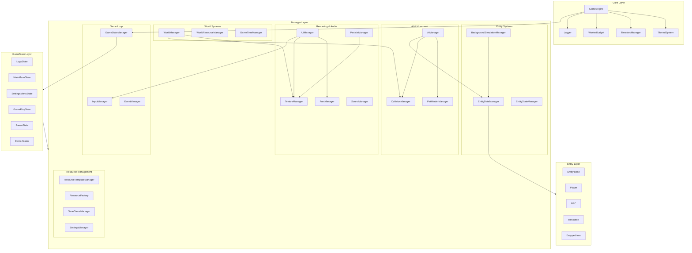

## Initialization Dependency Graph

## Update Loop Flow

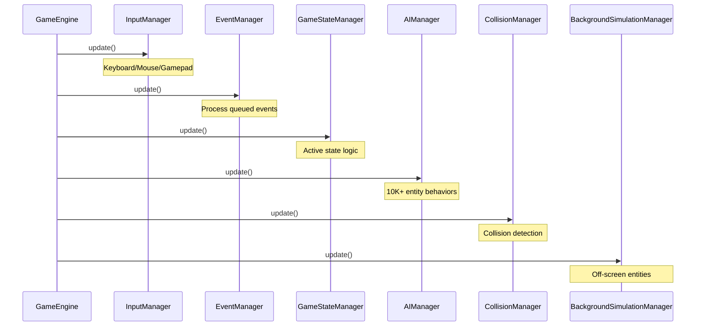

## Render Pipeline

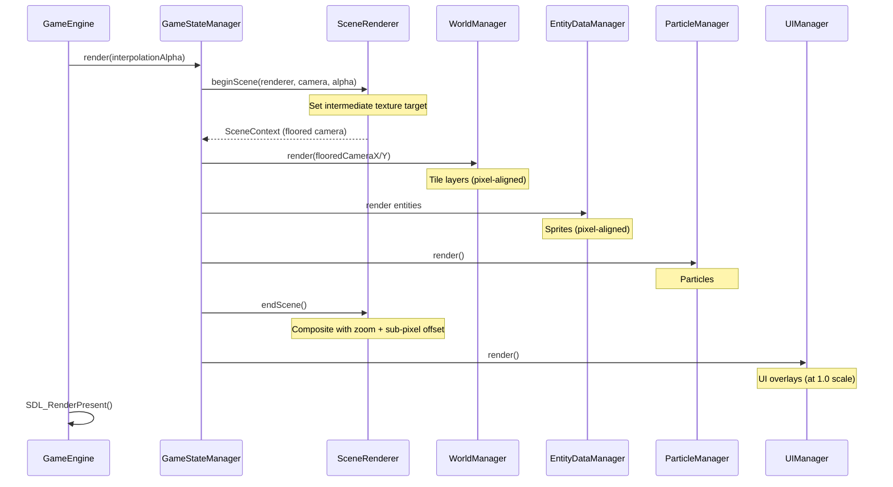

## GameState Flow

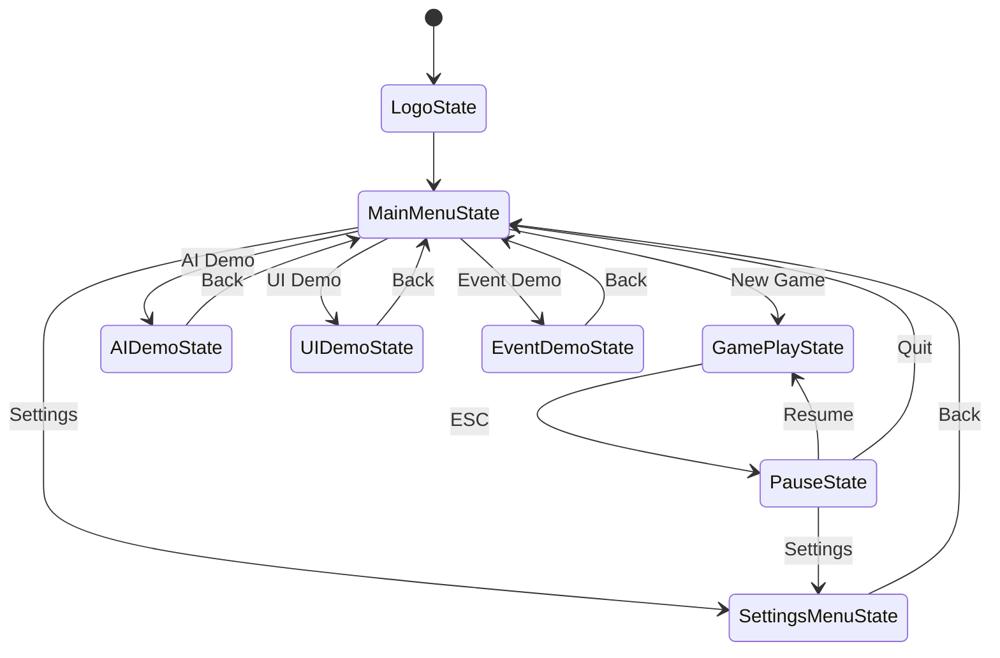

## Entity Hierarchy

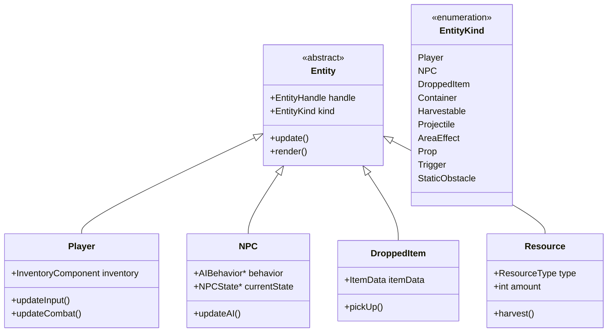

## AI System Architecture

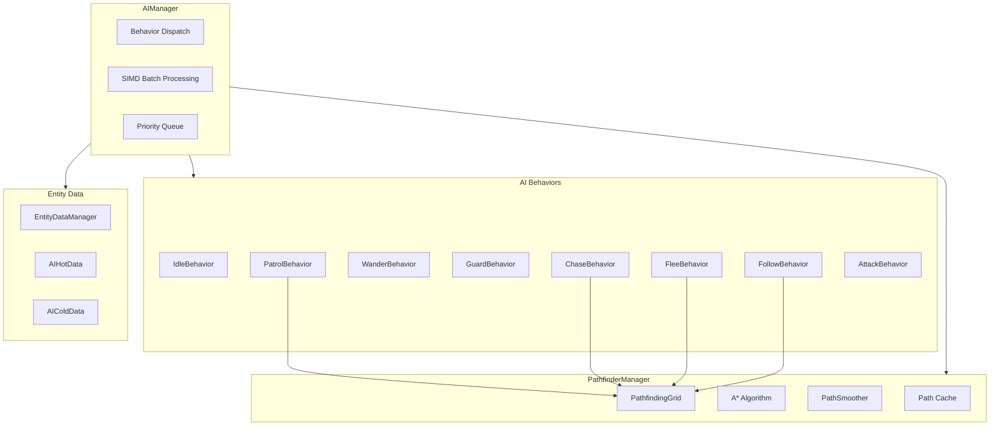

## Event System

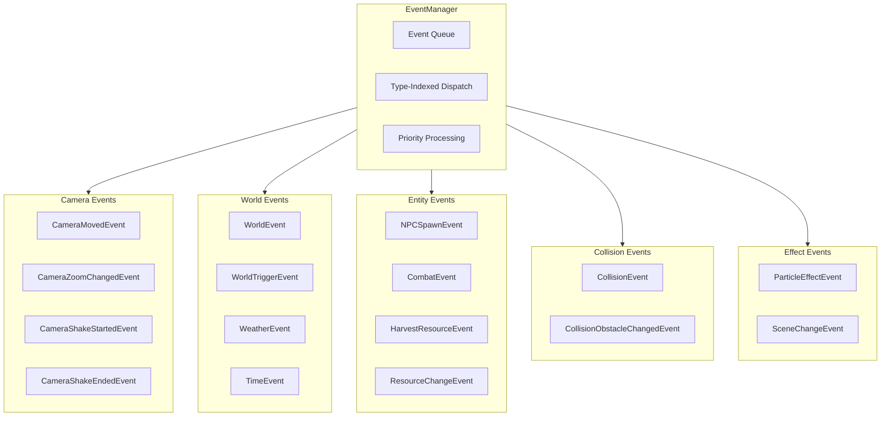

## Threading Model

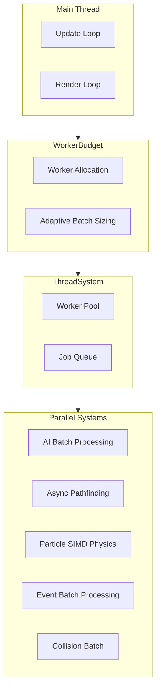

## Collision System

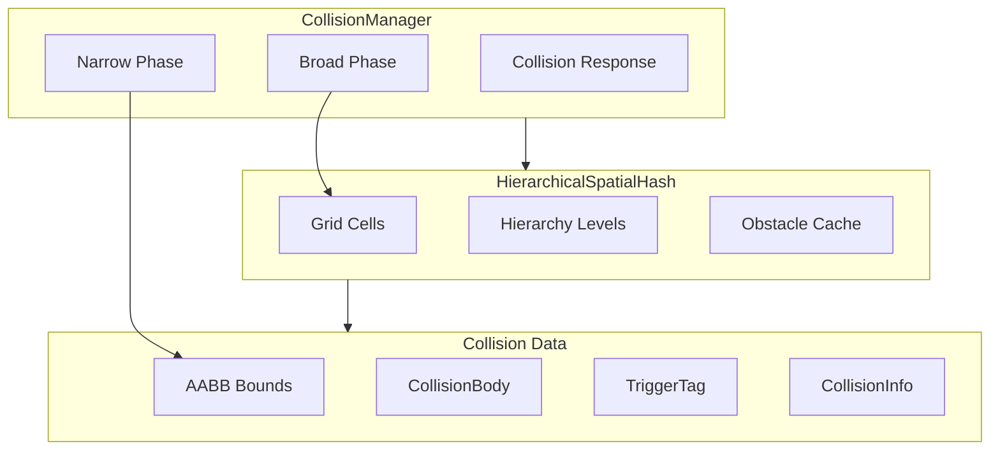

## Data-Oriented Design (EntityDataManager)

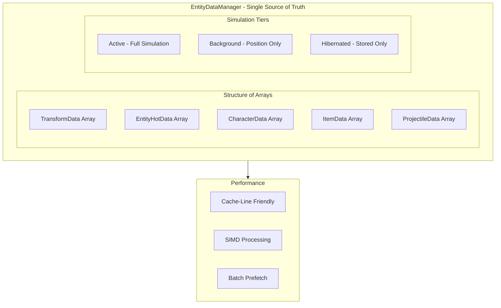

## Directory Structure

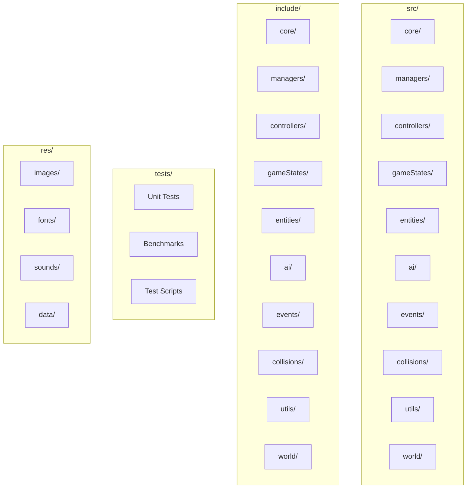

## Manager Responsibilities

| Manager | Responsibility | Key Features |
|---------|---------------|--------------|
| **GameEngine** | Main loop orchestrator | Fixed timestep, SDL init |
| **GameStateManager** | State machine | Push/pop/change states |
| **EntityDataManager** | DoD entity storage | SOA, simulation tiers |
| **AIManager** | 10K+ entity AI | SIMD batch, behavior dispatch |
| **PathfinderManager** | A* pathfinding | Async grid rebuilds, caching |
| **CollisionManager** | Spatial collision | Hierarchical hash, AABB |
| **EventManager** | Event dispatch | Type-indexed, priority queue |
| **ParticleManager** | 10K+ particles | SIMD physics, camera culling |
| **WorldManager** | Tile rendering | Chunk caching, procedural gen |
| **UIManager** | UI components | DPI scaling, theming |
| **GameTimeManager** | Day/night cycle | Weather scheduling |

## Utility Classes

| Utility | Responsibility | Key Features |
|---------|---------------|--------------|
| **SceneRenderer** | Pixel-perfect zoomed rendering | Intermediate texture, sub-pixel scrolling |
| **Camera** | View management | Follow mode, zoom levels, interpolation |

## Performance Characteristics

- **AI Scale**: 10K+ entities @ 60+ FPS (SIMD batch processing)
- **Particles**: 10K+ particles with camera-aware culling
- **Collision**: O(1) spatial hash lookups
- **Memory**: ~5MB for 100K entities (DoD) vs ~30MB traditional
- **Threading**: Adaptive batch sizing via throughput monitoring
